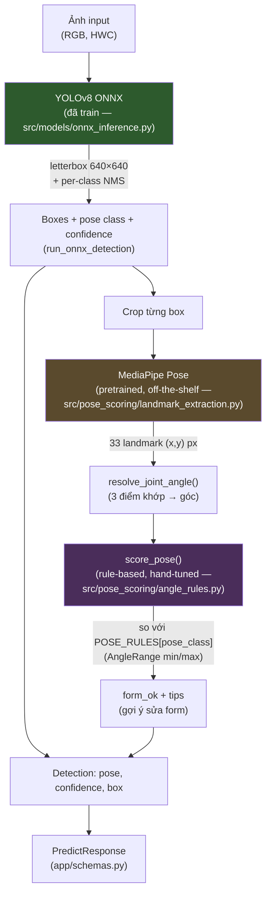
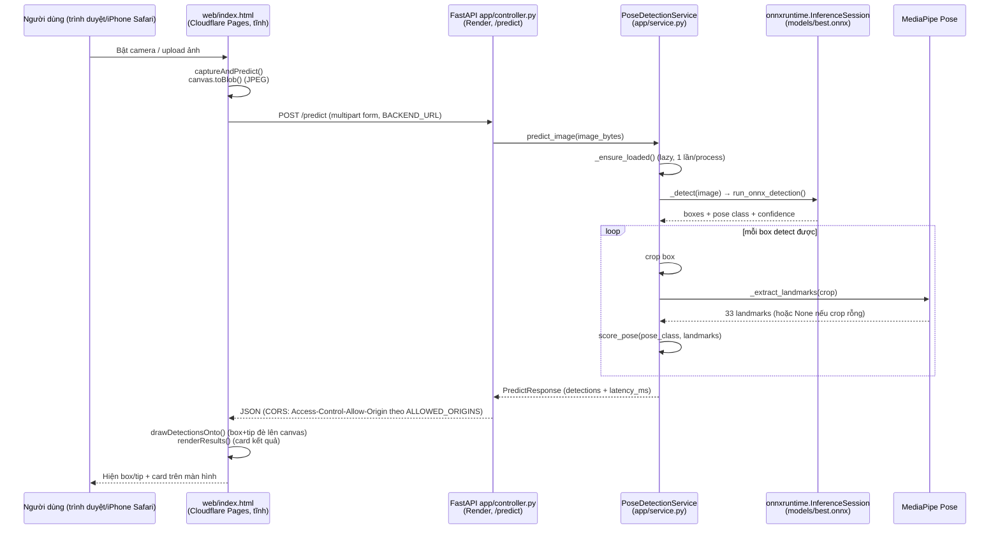
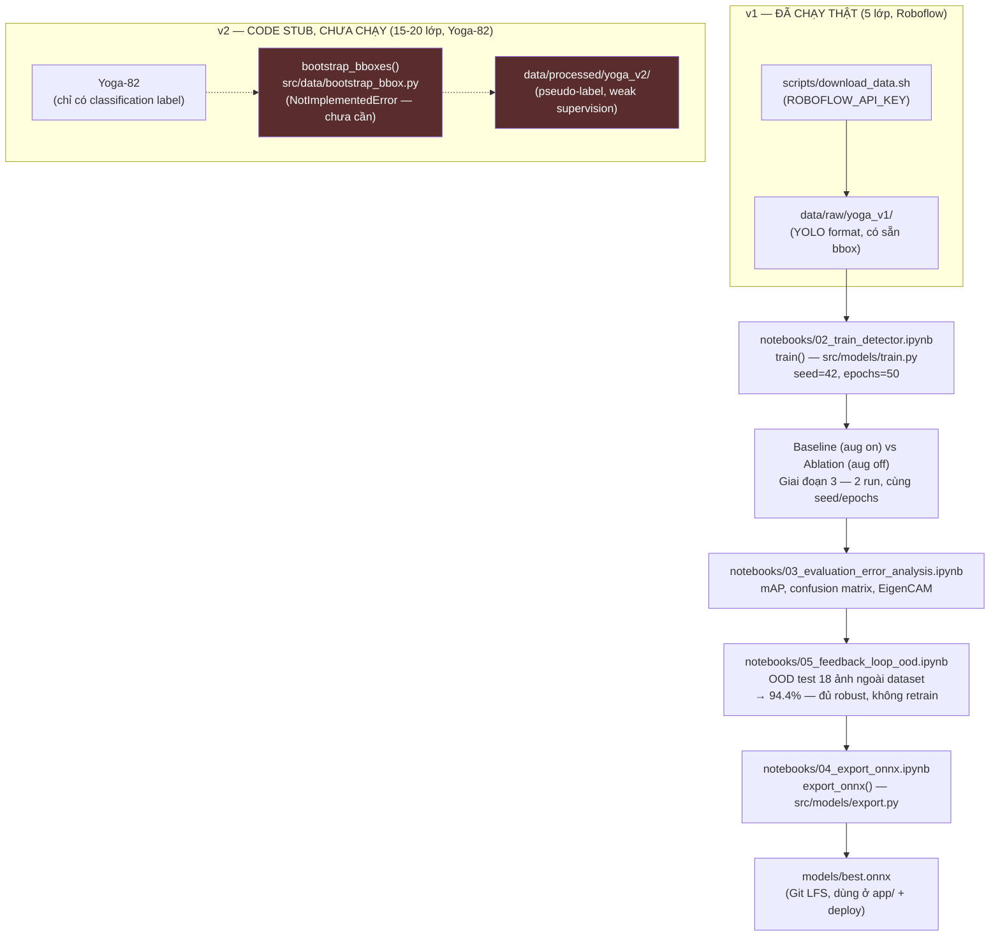
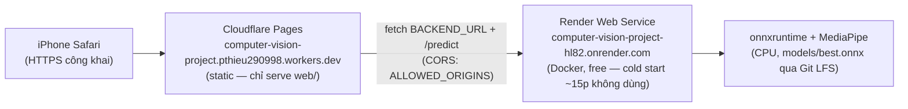

# Kiến trúc

Sơ đồ dưới đây phản ánh đúng code thật trong repo tại thời điểm viết (sau
Giai đoạn 9) — không phải bản dự kiến ban đầu. 3 sơ đồ: (1) kiến trúc model
suy luận, (2) luồng request end-to-end từ trình duyệt tới API, (3) luồng
dữ liệu/training.

## 1. Kiến trúc model — 2 lớp độc lập

Model **được train** là YOLOv8 (detect + classify tư thế trong 1 bước, xuất
ONNX). Sau đó mỗi box được crop và đưa qua MediaPipe Pose (**pretrained,
không train**) để lấy 33 keypoint, rồi so với ngưỡng góc khớp thủ công
(`POSE_RULES`, **rule-based, không phải model**) để chấm form. 3 loại khối
này được chấm điểm khác nhau trong rubric (mục 1-4,7 dùng model train được;
mục 6 là "ý tưởng riêng", không có accuracy/F1 của chính nó) — xem
`CLAUDE.md`.

**Chú thích màu:** xanh lá = model tự train (YOLOv8, rubric mục 1-4,7);
vàng = pretrained dùng nguyên (MediaPipe Pose, không tính vào accuracy của
model chính); tím = rule-based thủ công (không phải model, rubric mục 6 —
"ý tưởng riêng", không có metric accuracy/F1 riêng).

## 2. Luồng request end-to-end (thật, đã deploy)

Frontend (`web/index.html`, tĩnh) và backend (`app/`, FastAPI) chạy tách
origin khi deploy thật (Cloudflare Pages + Render — Giai đoạn 9); khi chạy
local qua `uvicorn app.main:app`, backend tự mount luôn `web/` cùng origin
(không cần bước CORS). Model + MediaPipe chỉ load **1 lần** lúc có request
đầu tiên (`PoseDetectionService._ensure_loaded()`, lazy), không load lại
mỗi request.

`/predict_video` (`app/controller.py`) đã wire route nhưng
`PoseDetectionService.predict_video()` vẫn raise `NotImplementedError` —
optional (T7.7), không làm vì ngoài phạm vi buffer thời gian, web demo xử
lý video bằng cách gọi lặp lại `/predict` mỗi frame phía client (xem
`CAPTURE_INTERVAL_MS` trong `web/index.html`), không phải 1 endpoint video
streaming thật.

## 3. Luồng dữ liệu & training

**v1 là pipeline duy nhất đã chạy hết vòng đời thật** (download → train →
ablation → eval → export → deploy). **v2 vẫn là code stub**
(`bootstrap_bboxes()` raise `NotImplementedError`) — không triển khai vì
Giai đoạn 5 (feedback loop) đo được OOD accuracy 94.4% trên baseline v1,
không tìm ra pattern lỗi cần dataset lớn hơn để sửa, nên quyết định không
cần v2 (đúng tinh thần buffer PLAN.md: chỉ làm v2 nếu dư thời gian).

## Deploy topology thật (Giai đoạn 9)

Phương án thay thế (đã build + review, chưa dùng): VPS riêng + Caddy
(`docker-compose.yml`, `Caddyfile`) — gộp frontend+backend 1 process, không
cold start, dùng nếu Render free không đủ ổn định (xem
`docs/specs/g9-deploy-public.md`).
